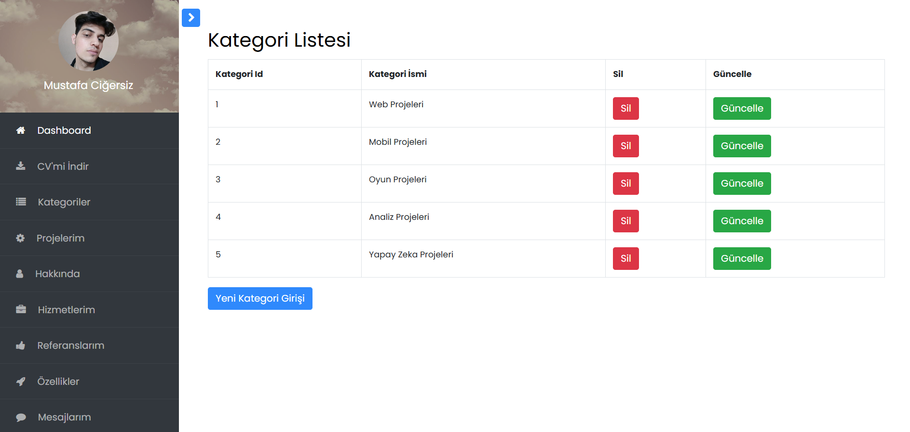
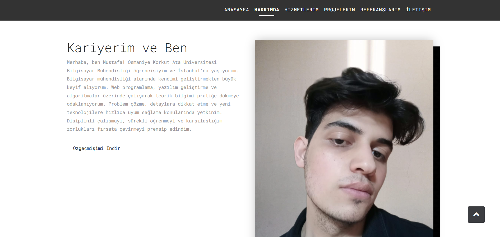
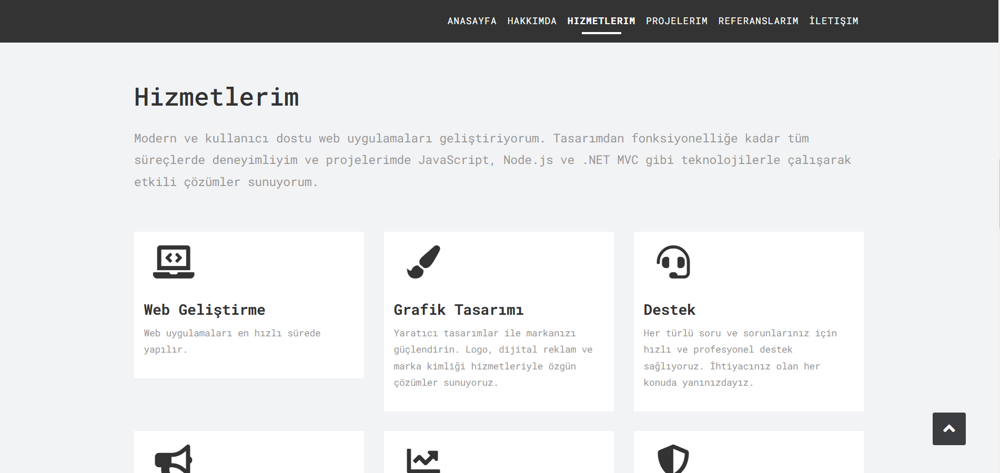
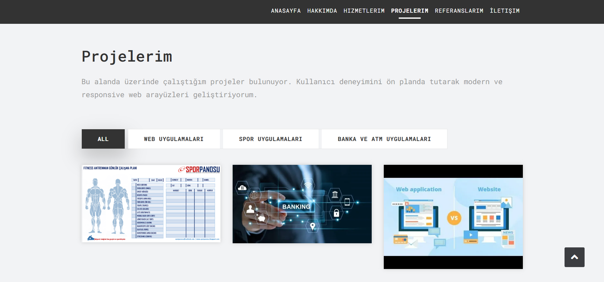
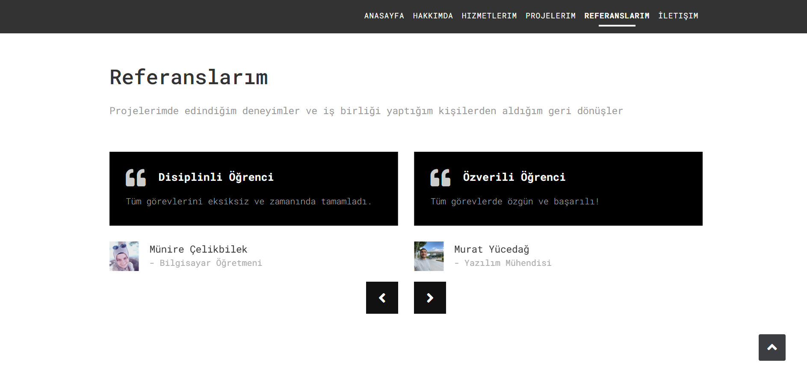
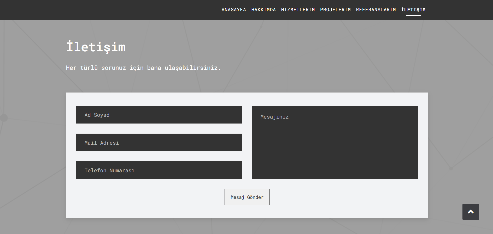

# 🥇 Admin Panelli Portfolyo Projesi

## Genel Bakış
Bu proje, admin paneli aracılığıyla portföy yönetimi sağlar. Admin paneli, kullanıcıların kolayca veri ekleyip güncelleyebileceği, düzenleyebileceği ve silebileceği bir CRUD (Create, Read, Update, Delete) arayüzü sunar. Kullanıcı arayüzü ise şık, modern ve dinamik bir tasarıma sahip olup, kullanıcı dostudur ve her işlem hızlıca yapılabilir.

## Kullanıcı Arayüzü ve Tasarım
Proje, kullanıcı deneyimini ön planda tutarak modern bir tasarım sunar. Dinamik yapısı ile kullanıcılara kolay navigasyon sağlar.

---

## Teknolojiler ve Kullanılan Araçlar

🎯 **Microsoft SQL Server (MSSQL)**: Proje, güçlü ilişkisel veritabanı yönetim sistemi olan SQL Server ile veri yönetimini sağlar.

💢 **ASP.NET MVC**: Uygulama, Model-View-Controller mimarisiyle geliştirilmiştir. Bu yapı, uygulamanın düzenini ve bakımını kolaylaştırır.

📖 **Entity Framework**: Veritabanı işlemleri için kullanılan ORM (Object Relational Mapping) aracıdır. Bu teknoloji sayesinde veritabanı ve uygulama arasındaki etkileşim nesne tabanlı hale gelir.

💥 **Layout Kontrolü**: Sayfa düzeni, modern ve kullanıcı dostu bir deneyim için optimize edilmiştir.

🏹 **Db First Yaklaşımı**: Entity Framework kullanılarak, veritabanı ilk olarak oluşturulup daha sonra modelle entegre edilmiştir.

🔖 **CRUD İşlemleri**: Admin paneli aracılığıyla portföy üzerindeki veriler üzerinde ekleme, okuma, güncelleme ve silme işlemleri yapılabilir.

✍️ **HTML**: Kullanıcı arayüzü için temel yapı HTML ile inşa edilmiştir.

⚔️ **CSS**: Modern ve şık bir tasarım sağlamak için CSS kullanılmıştır.

📑 **Bootstrap**: Mobil uyumlu, responsive ve şık bir tasarım için Bootstrap framework’ü tercih edilmiştir.

---

## Projemden Bazı Kesitler

Aşağıda, projemden bazı kesitler yer almaktadır:

### Admin Panel Görseli

  
*Admin panelinin ekran görüntüsü.*

### Kullanıcı Arayüzü

  
*Kullanıcı arayüzüne ait şık bir ekran görüntüsü.*

  
*Kullanıcı arayüzüne ait şık bir ekran görüntüsü.*

  
*Kullanıcı arayüzüne ait şık bir ekran görüntüsü.*

  
*Kullanıcı arayüzüne ait şık bir ekran görüntüsü.*

  
*Kullanıcı arayüzüne ait şık bir ekran görüntüsü.*

  
*Kullanıcı arayüzüne ait şık bir ekran görüntüsü.*

---
